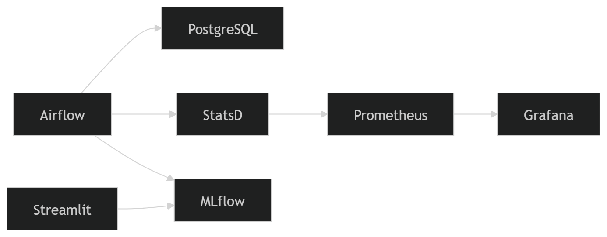

# Hydraulic System Health Prediction

Ce projet implémente un pipeline MLOps complet pour prédire l'état de santé d'une valve hydraulique. Il intègre l'orchestration de données, le suivi d'expériences, le déploiement d'une interface utilisateur et le monitoring des performances.

## Architecture du Projet

L'écosystème repose sur une architecture conteneurisée via **Docker Compose** :

* **Orchestration :** Apache Airflow (Preprocessing, Feature Engineering, Training).
* **Tracking & Registry :** MLflow (Suivi des métriques et gestion des versions du modèle).
* **Interface Web :** Streamlit (Prédiction en temps réel par cycle).
* **Monitoring :** Prometheus & Grafana (Suivi des performances système via StatsD Exporter). <br>



## Installation et Lancement

1.  **Cloner le dépôt :**
    ```bash
    git clone git@github.com:Rochdyath/hydraulic_system_health_prediction.git
    cd hydraulic_system_health_prediction
    ```

2.  **Préparer les dossiers et permissions :**
    ```bash
    mkdir -p ./data/raw ./data/processed ./mlruns
    chmod -R 777 ./mlruns ./data
    ```

3.  **Lancer l'infrastructure :**
    ```bash
    docker-compose up -d --build
    ```

## Pipeline de Données (DAGs)

Le DAG `process_data` automatise les étapes suivantes :
1.  **Extraction :** Chargement des fichiers bruts (PS2, FS1, Profile).
2.  **Preprocessing :** Nettoyage et création des labels binaires (Optimal vs Non-Optimal).
3.  **Feature Engineering :** Calcul des statistiques glissantes (mean, std, max, min) par cycle. <br>

Le DAG `valve_training_pipeline` automatise les étapes suivantes :
1. **Chargement des données :** Récupère les données préalablement traitées.
2. **Séparation des données :** Split les données en données de test et d'entrainement.
3. **Entrainement et Test :** Entraînement et test d'un modèle et enregistrement et versionning automatique du model.

## Services Disponibles

| Service | URL | Description |
| :--- | :--- | :--- |
| **Airflow** | `http://localhost:8081` | Gestion et exécution des pipelines (DAGs) |
| **MLflow** | `http://localhost:5000` | Tracking des expériences et registre de modèles |
| **Streamlit** | `http://localhost:8501` | Application web de prédiction |
| **Grafana** | `http://localhost:3000` | Dashboards de monitoring |
| **Prometheus** | `http://localhost:9090` | Base de données des métriques |

## Tests

Les tests unitaires sont automatisés via **Pytest**. Pour les lancer localement :
```bash
pytest tests/
```

## Monitoring

Les métriques d'Airflow sont exposées via `statsd-exporter` vers **Prometheus**. Vous pouvez visualiser dans **Grafana** :
* Le taux de succès des tâches Airflow.
* La distribution des prédictions (Optimales vs Dégradées) faites sur l'application Streamlit.

---

### Auteur
* **BACHABI Rochdyath** - Projet M2 MLOps - YNOV Nanterre (2026)
